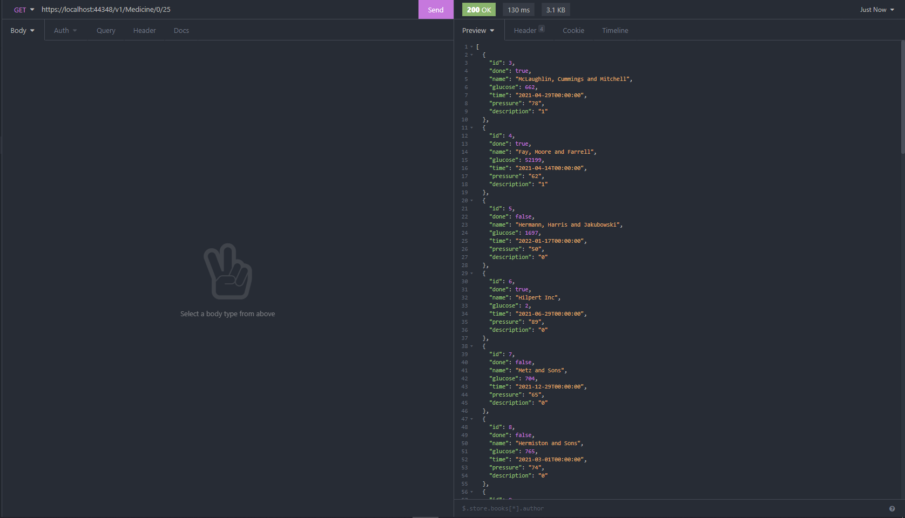
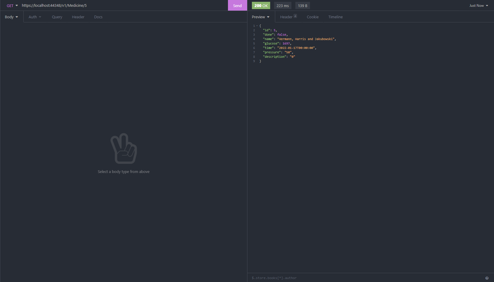
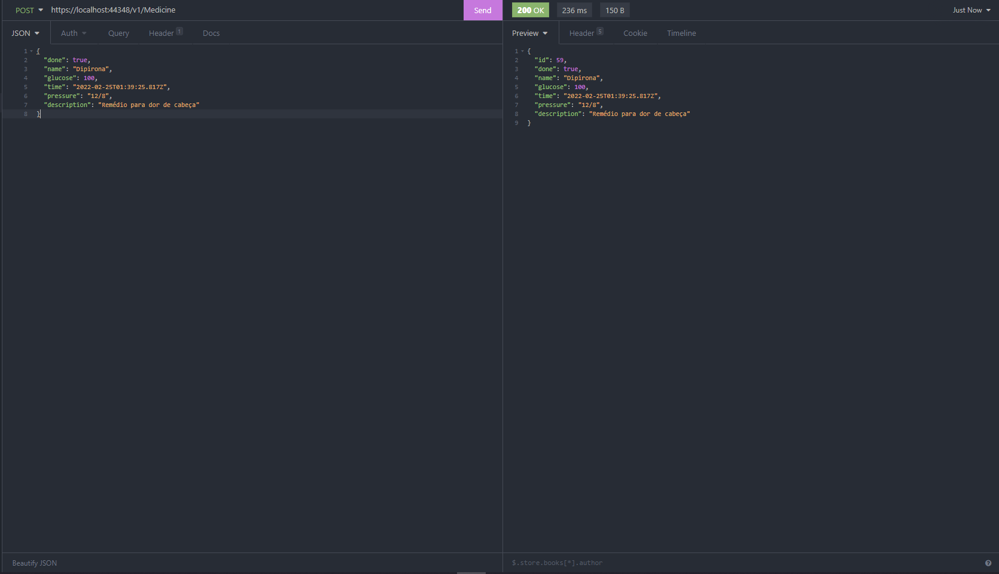
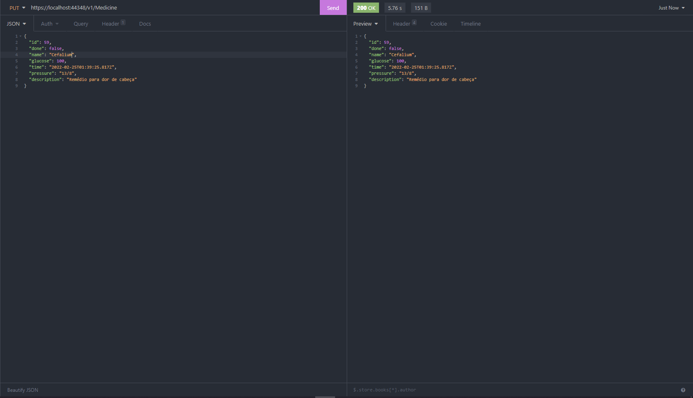
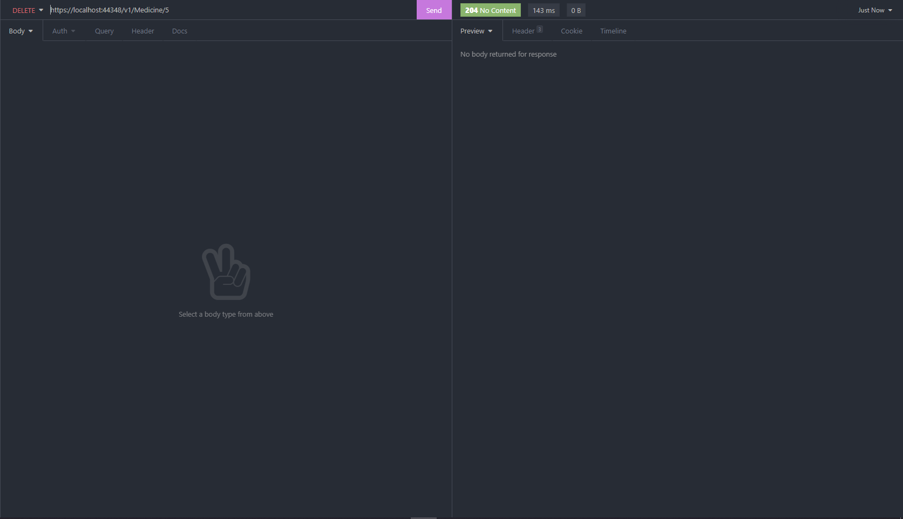

<h1 align="center">Medicine API 👩🏿‍⚕️</h1>
 
 

Criação de uma api simples, com conceitos importantes que será consumida por um aplicativo mobile

Essa api é um crud simples que tem como objetivo salvar as informações sobre medicações usadas durante o dia e anotações sobre glicose e pressão arterial. As informações poderam ser consultadas, criadas, atualizadas e compartilhadas a qualquer momento. 

A construção dessa api foi montanda pensando em conceitos como clean code e padroões de projetos que facilitam a manutembilidade e testagem do código.

Para armazenar os dados é necessário a utilização de um banco de dados. Nesta api o banco escolhido foi SQL Server. Falando sobre base de dados, neste projeto foi utilizado o conceito de migrações. Oferecendo assim uma maneira de atualizar de forma incremental o esquema de banco de dados para mantê-lo em sincronia com o modelo de dados do aplicativo. Ainda sobre as migrações, para criar a tabela no banco dados foi utilizado o conceito de Code First, onde criamos uma classe que representa a tabela no banco de dados. Nessa classe foram utilizadas as anotações para realizar validações e o comportamento das colunas no banco de dados.

Para desacoplar o modelo de domínio do código de acesso a dados, utilizamos o Padrão Repository. Que consiste na criação de Interfaces que terão contratos que serão implementados pela classe que herdar essa interface. Nesta classe, desenvolvemos nossas nossas regras e persistencia ao banco de dados. Aplicando esse padrão, além de facilitar a manutenbilidade e testagem do código, afastamos do controlle o contato direto com a persistencia de dados. O mesmo fica responsável por realizar as validações da classe repository.

Imagina realizar uma requisição get para listar todas as informações do banco. Imaginou? até ai tudo bem, agora imagina esse retorno trazer 1000, 2000 conjuntos de dados do banco de dados, Alem de do processo ser lento, pode impactar diretamente na aplicação. Para melhorar esse cenário foi utilizado as paginações para que um retorno máximo seja padronizado evitando uma consulta muito grande na base de dados. Neste projeto o limite de informações trazidas por requisição é de no máximo 25. A logica para buscar é feita pela url, nela podemos escolher de onde vamos começar e quanto vamos buscar.

 

<h1 align="center">Funcionamento da API 👨🏾‍💻</h1>

Abaixo teremos algumas imagens dos retornos dos endpoints da nossa api

 

🟣 GET - Essa requisição retorna todas as informações na base de dados. Podemos ver no parâmetro da url os valores 0 e 25, onde estamos dizendo que começaremos a partir da posição 0 e pegaremos 25 informações.

 

🟣 GET - Essa requisição retorna dados especificos atravês do seu identificador único que foi passado no parâmetro da url

 

 🟢 POST - Essa requisição cria um novo conjunto de dados na nossa base, diferente das requisições anteriores, nessa nós passamos as informações no corpo da requisição via JSON

 

🟠 PUT - Essa requisição faz a atualização de alguma informação já existente no banco de dados atravês do seu identificador único. Diferente da requisição anterior, foi passado mais um campo que é o ID

 

🔴 DELETE - Essa requisição como o nome diz, faz a remoção de alguma informação no banco de dados atravês do seu identificador único. No caso de deleção, o padrão de retorno da requisição delete são retornos sem conteúdo

 

<h2 align="center">Projeto finalizado 🚧</h2>
 

A API em questão esta sujeita a melhoria, visto que já existem itens em backlog

